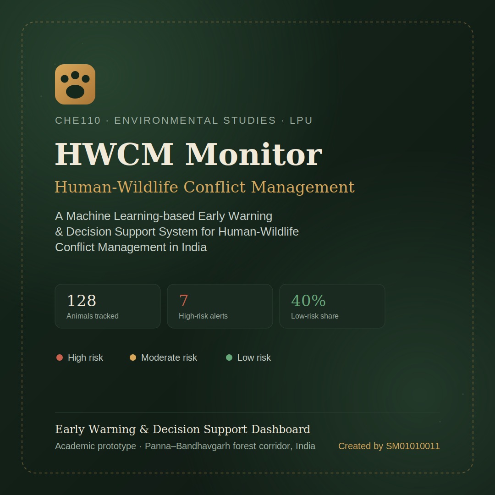
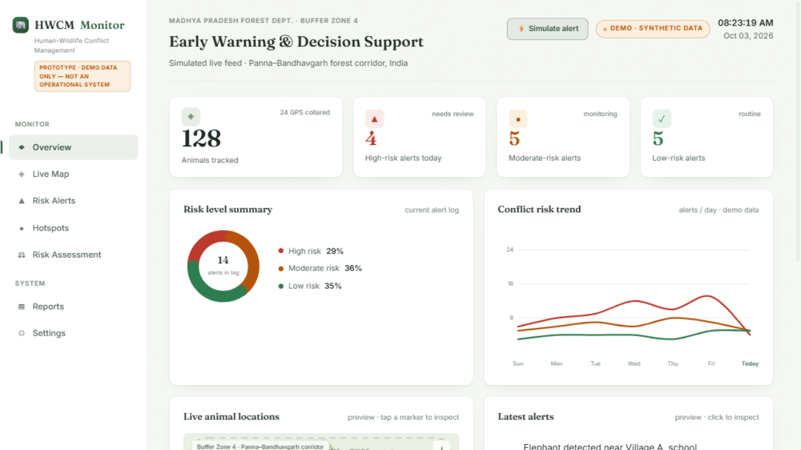
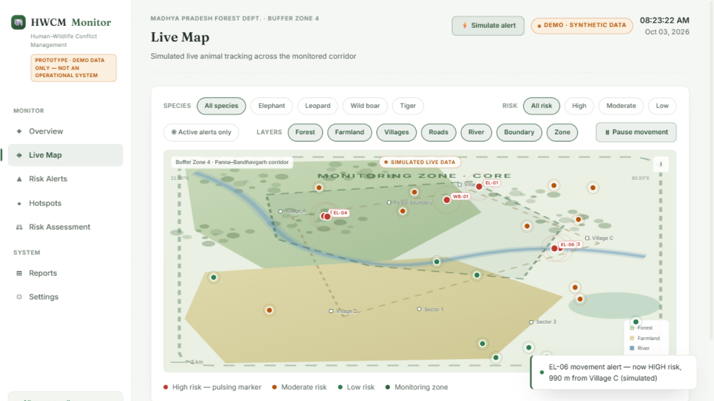
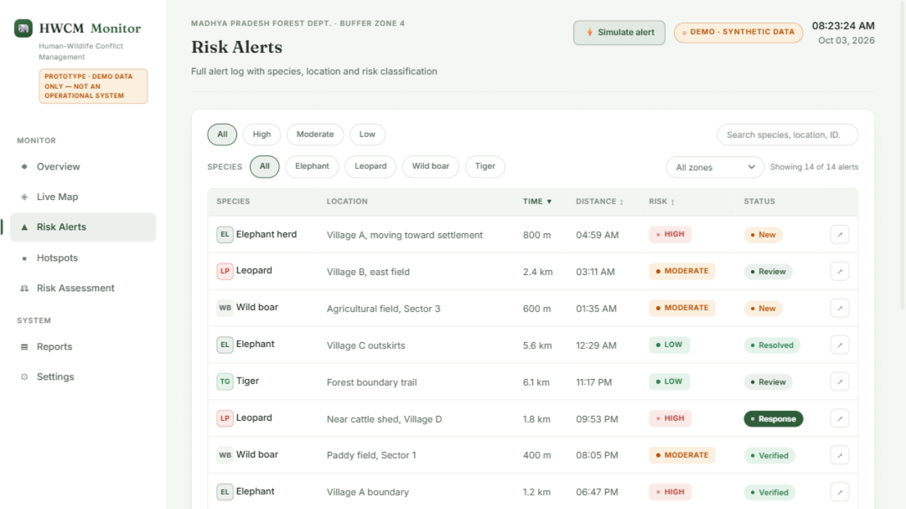
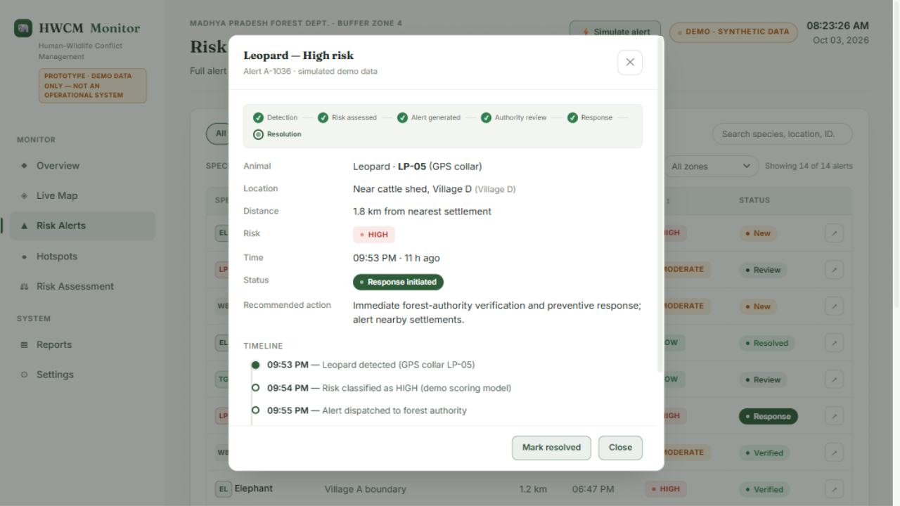
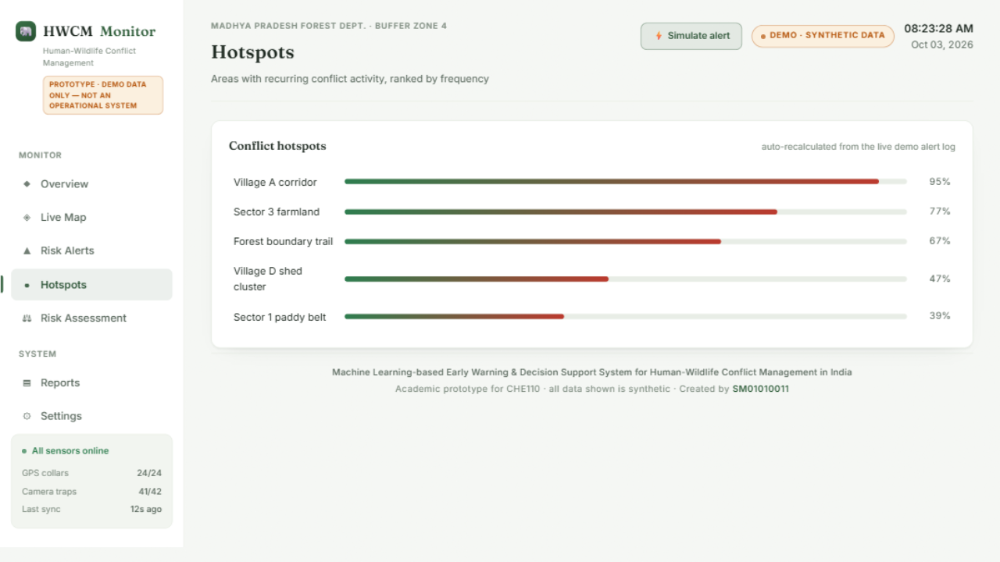
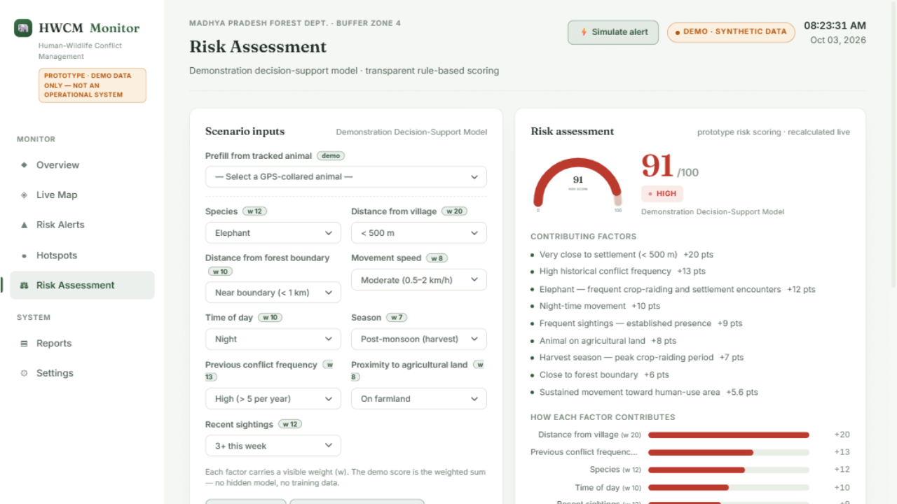
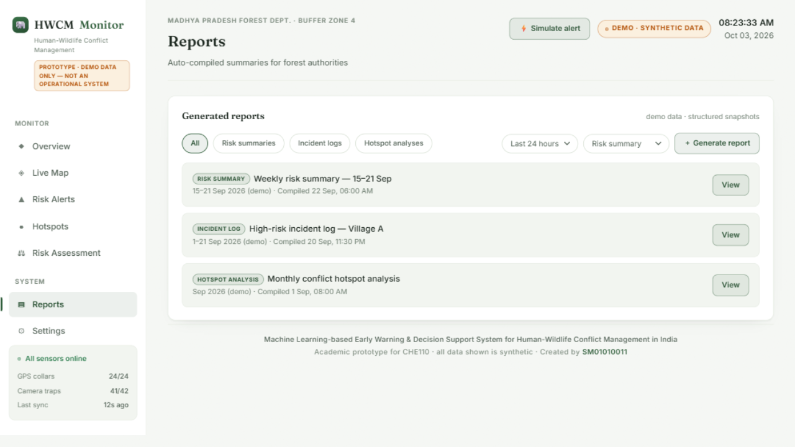
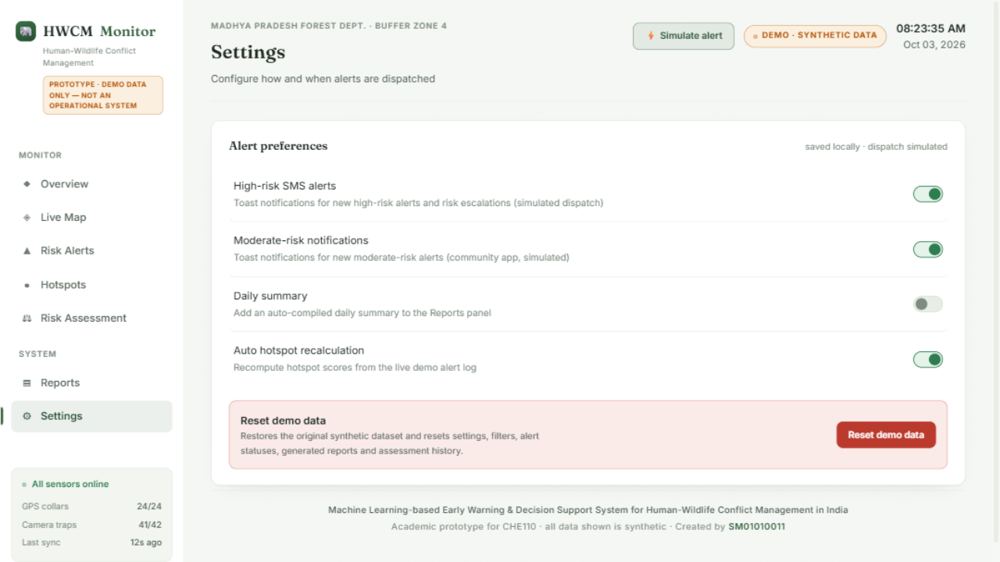
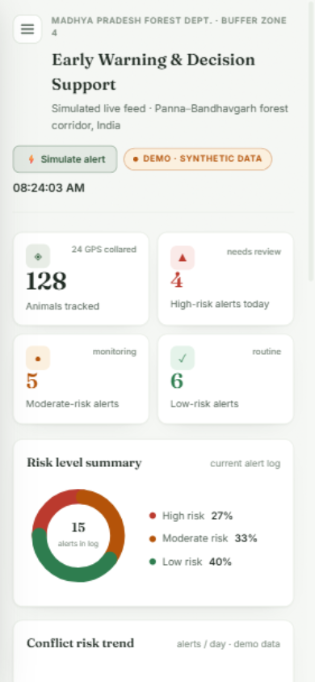

# 🐾 HWCM Monitor

### Machine Learning-based Early Warning & Decision Support System for Human-Wildlife Conflict Management in India

> Academic prototype (CA1) · **CHE110 – Environmental Studies** · Lovely Professional University
> ⚠️ **Demo / synthetic data only** — this is a front-end prototype, not an operational system.

Deploy: https://sm01010011.github.io/Human_Wildlife_Conflict_Management/



An interactive dashboard prototype that demonstrates how a data-driven early-warning workflow could help forest authorities anticipate human-wildlife conflict: GPS-collared animals are tracked on a simulated forest-corridor map, a transparent rule-based scoring model classifies conflict risk (Low / Moderate / High), alerts flow through a human-verification workflow, and auto-compiled reports summarise the picture for decision-makers.

---

## 📸 Screenshots

### Overview
Live KPI cards (animals tracked, high/moderate/low-risk alerts), a data-driven 7-day risk trend, a risk-level donut, and preview panes for the live map and latest alerts.



### Live Map
A stylised GIS view of the Panna–Bandhavgarh buffer zone with toggleable layers (forest, farmland, villages, roads, river, boundary, monitoring zone). 24 GPS-collared animals move in a controlled simulation; markers are colour-coded by risk — high-risk markers pulse and carry their animal ID — and clicking one opens an info panel with distance to settlement, movement status and risk factors.



### Risk Alerts
A searchable, filterable, sortable alert log (severity, species, zone, distance, time, risk, workflow status).



### Alert detail & workflow
Every alert carries a status — **New → Under Review → Verified → Response Initiated → Resolved** (or **Dismissed**) — advanced interactively by the user, with a visual workflow stepper and a full event timeline.



### Hotspots
Recurring conflict zones ranked by 30-day frequency, recalculated from the live demo alert log.



### Risk Assessment — Demonstration Decision-Support Model
Enter a scenario (species, distances, movement, time, season, conflict history, farmland proximity, sightings) and get a transparent **weighted risk score /100**, contributing-factor breakdown, and a recommended response. Every factor's weight is visible; nothing is hidden.



### Reports
Auto-compiled report snapshots (risk summaries, incident logs, hotspot analyses) with species distribution, response status and key observations — filterable, viewable, downloadable (.txt), and generatable from the current alert log.



### Settings & persistence
Alert-notification preferences, daily-summary reports and hotspot recalculation — saved to `localStorage` — plus a one-click **Reset Demo Data** flow with confirmation.



### Responsive
Usable from desktop down to mobile (drawer navigation, horizontally scrollable tables, bottom-sheet panels).



---

## ✨ Features

- **Overview** — clickable KPI cards, data-driven donut and 7-day trend with hover tooltips
- **Live Map** — layered corridor map, simulated animal movement (pause/resume), species + risk + "active alerts only" filters, animal info panel
- **Risk Alerts** — search / severity / species / zone filters, column sorting, alert-detail modal with timeline
- **Alert workflow** — New → Under Review → Verified → Response Initiated → Resolved / Dismissed, with confirmation dialogs and persisted statuses
- **Risk Assessment** — transparent weighted scoring demo with visual factor contributions, saved history and .txt export
- **Hotspots** — live-recalculated conflict-zone ranking
- **Reports** — structured, filterable, generatable, downloadable
- **Settings** — persisted preferences + **Reset Demo Data**
- **Persistence** — settings, statuses, filters, generated reports and assessment history survive refresh via `localStorage`
- **Accessibility & UX** — keyboard-operable controls, visible focus states, `prefers-reduced-motion` support, empty/loading/error states, toast notifications, confirmation dialogs

---

## 📌 About

Human-wildlife conflict is a growing environmental and social challenge in India, driven by habitat loss, fragmentation and expanding settlements near forest corridors. This project proposes an ML-based early-warning and decision-support system that analyses animal location, movement, distance from settlements and historical conflict data to classify conflict risk as **Low, Moderate or High** — and routes high-risk situations to forest authorities for verification and preventive action.

This repository contains an interactive prototype demonstrating that workflow end-to-end.

> **Honesty note:** the prototype does **not** include a trained ML model, real GPS telemetry, forest-department integration or real-time wildlife data. The risk model is a transparent, rule-based demonstration, and every dataset in the app is synthetic.

---

## 🛠️ Tech

Plain **HTML5, CSS3 and vanilla JavaScript** — no frameworks, no build step, no backend. The map is hand-drawn SVG; charts are hand-rolled SVG; persistence uses `localStorage`.

```
hwcm-project/
├── index.html           # markup: 7 panels + modals + splash
├── style.css            # light theme, design tokens, components, responsive
├── script.js            # synthetic data, simulation, rendering, workflow, persistence
├── screenshots/         # preview images used in this README
├── demo.mp4             # recorded product tour
└── README.md
```

### Run locally

```bash
git clone <this-repo-url>
cd hwcm-project
# open index.html in a browser, or serve it:
python -m http.server 8080   # → http://localhost:8080
```

No dependencies to install. Use **Settings → Reset Demo Data** any time to restore the original dataset.

---

## 🧠 Methodology (summary)

Problem identification → literature review → data collection (GPS collars, camera traps, historical records) → preprocessing → feature engineering (distance from village/forest, movement speed, time, season, past conflict frequency) → risk classification → early-warning generation → human expert review → preventive action → feedback and retraining.

*In the prototype, the classification step is demonstrated by a transparent rule-based scoring model. Final decisions always remain with authorised forest and wildlife professionals.*

---

## 🎓 Academic acknowledgement

Created as part of Academic Task 1 (CA1) for **CHE110 – Environmental Studies**, Lovely Professional University, under the topic *"Machine Learning-based Early Warning and Decision Support Systems for Human-Wildlife Conflict Management in India."*

## 👤 Credits

**Created by SM01010011**

---

*This is an academic prototype for demonstration purposes only. All data, alerts, animals, locations and scores shown are synthetic and illustrative. It does not represent a validated ML model or a real-time prediction system.*
